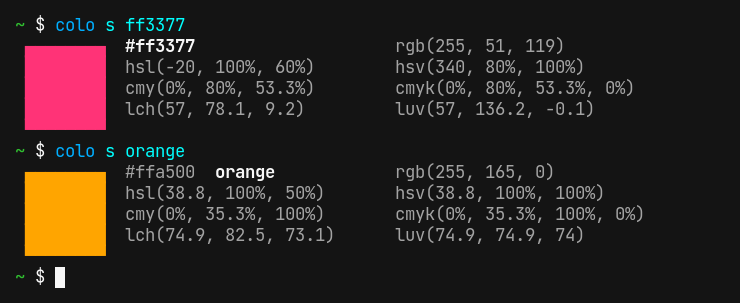
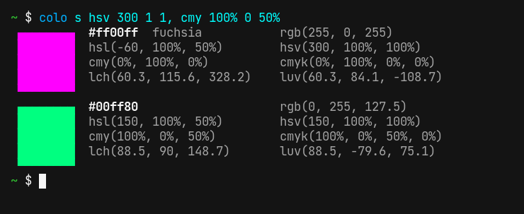
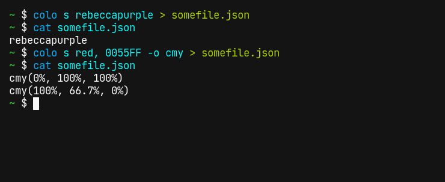
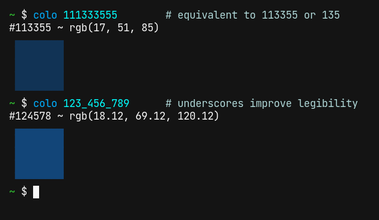
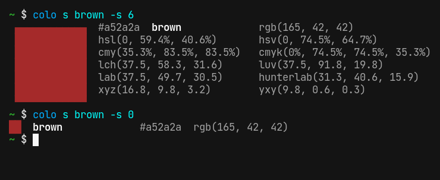
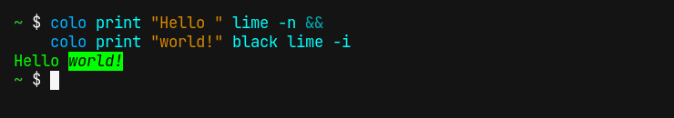
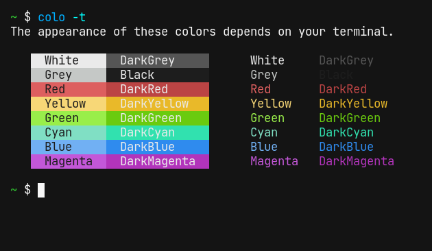

# colo

Command-line tool for displaying colors, written in Rust

[](./LICENSE) [](https://crates.io/crates/colo)

### Jump to...

* [Changelog](#changelog)
* [Installation](#installation)
    * [Build from source](#build-from-source)
* [Usage](#usage)
    * [Supported color spaces](#supported-color-spaces)
    * [Specifying hexadecimal colors](#specifying-hexadecimal-colors)
    * [Color square size](#color-square-size)
    * [Printing text](#printing-text)
    * [Default terminal colors](#default-terminal-colors)
* [Code of Conduct](#code-of-conduct)
* [Contributing](#contributing)


## Changelog

[The changelog can be found here](./CHANGELOG.md).

Note that `colo` is very young and evolving rapidly. There will likely be big changes in the next releases.

## Installation

Installation is explained on the [releases page](https://github.com/Aloso/colo/releases).

### Build from source

If you want to build `colo` from source, make sure you have the Rust toolchain (including Cargo) installed. Then clone this repository and run

```fish
cargo install --path .
```

Or, if you don't want to clone the repository, you can run

```fish
cargo install --git https://github.com/Aloso/colo
```

This builds the code from the main branch. You can specify a different branch with `--branch` or a tag with `--tag`.

## Usage

`colo`'s most important subcommand of `show`, or `s` for short. It recognizes hexadecimal RGB colors as well as HTML color names:



Color spaces other than RGB can be entered as well:



If `colo` is used outside of a terminal, it outputs the color as text. The format can be specified with the `-o`/`--out` flag:



### Supported color spaces

Read in more detail about these color spaces [here](https://aloso.github.io/colo/color_spaces#srgb-rgb).

| Name        | Description                     | Range of values     |
|-------------|---------------------------------|---------------------|
| `rgb`       | red, green, blue                | 0 to 255            |
| `cmy`       | cyan, magenta, yellow           | 0 to 1              |
| `cmyk`      | cyan, magenta, yellow, key      | 0 to 1              |
| `hsl`       | hue, saturation, light          | hue: 0 to 360, saturation: 0 to 1, light: 0 to 1     |
| `hsv`       | hue, saturation, value          | hue: 0 to 360, saturation: 0 to 1, value: 0 to 1     |
| `lab`       | CIELAB (lightness, a, b)        | lightness: 0 to 100 |
| `lch`       | CIELCh (luminance, chroma, hue) | luminance: 0 to 100, chroma: 0 to 100, hue: 0 to 360 |
| `luv`       | CIELUV (luminance, u, v)        | luminance: 0 to 100, u: -134 to 220, v: -140 to 122  |
| `hunterlab` | Hunter Lab (lightness, a, b)    | lightness: 0 to 100 |
| `xyz`       | CIE XYZ (x, lightness, z)       | lightness: 0 to 100 |
| `yxy`       | CIE Yxy (lightness, x, y)       | lightness: 0 to 100 |

### Specifying hexadecimal colors

Hexadecimal colors are a different notation for RGB colors. They can optionally be prefixed with a `#`, e.g. `colo s "#F00"`.

Hexadecimal colors can be specified with varying precision: Each color channel can be between 1 and 8 digits long, for example



### Color square size

The color square size can be adjusted with `--size` or `-s`:



### Printing text

With the `print` subcommand, text can be printed with color and style. The subcommand accepts text to print, and then 1 or 2 colors, for the text and the background. To use different styles in the same line, the `-n` flag can be used, which prevents adding a line break:



The following flags are available:

- `-b` for bold text
- `-i` for italic text
- `-u` for underlined text
- `-n` to _not_ print a new line afterwards

### Default terminal colors

With the `term` subcommand, the default terminal colors are printed:



## Code of Conduct

Since this program is written in Rust, the [Rust code of conduct](https://www.rust-lang.org/policies/code-of-conduct) applies. Please be friendly and treat everyone with respect.

## Contributing

I appreciate your help! The easiest way to help is to file bug reports or suggest new features in the [issue tracker](https://github.com/Aloso/colo/issues).

If you want to create a pull request, make sure the following requirements are met:

  * The code is documented
  * If you add a dependency that includes unsafe code, please explain why it is required
  * Please try to keep compile times small, if feasible

Also, to pass continuous integration, the code must

  * be properly formatted with `cargo fmt`
  * pass `cargo clippy`
  * compile on the latest stable Rust version
  * all tests must succeed

You can also look in the issue tracker for issues with the label [help wanted](https://github.com/Aloso/colo/issues?q=is%3Aissue+is%3Aopen+label%3A%22help+wanted%22).

That's it! If you have any questions, feel free to create an issue.
