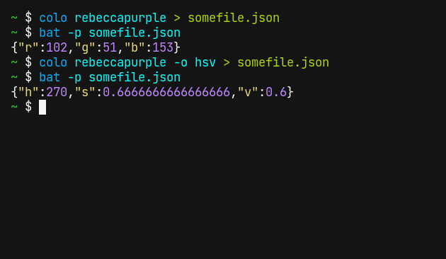
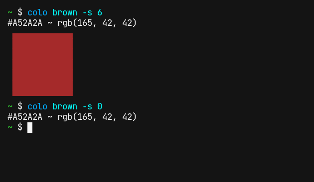

# colo

Command-line tool for displaying colors, written in Rust

## Status

Experimental – expect to see some big changes before the first release.

## How to install

Since `colo` is written in Rust, you need the Rust compiler and the `cargo` package manager ([installation manual](https://www.rust-lang.org/tools/install)). Once you have installed the Rust toolchain, clone this repository and run

```shell
$ cargo install --path .
```

You might have to add the `.cargo/bin` folder to your `PATH` afterwards.

## Usage

`colo` recognizes hexadecimal RGB colors as well as HTML color names:


Color spaces other than RGB are supported as well:


If `colo` is used outside of a terminal, it outputs JSON, because it is the most ubiquitous data format:



## Supported color spaces

| Name   | Short | Description                        | Range of values |
|--------|-------|------------------------------------|-----------------|
| `rgb`  | `r`   | red, green, blue                   | 0 to 255        |
| `cmy`  | `c`   | cyan, magenta, yellow              | 0 to 1          |
| `cmyk` | `k`   | cyan, magenta, yellow, key         | 0 to 1          |
| `hsv`  | `v`   | hue, saturation, value             | hue: 0 to 360, saturation: 0 to 1, value: 0 to 1 |
| `hsl`  | `l`   | hue, saturation, light             | hue: 0 to 360, saturation: 0 to 1, light: 0 to 1 |
| `lch`  |       | luminance, chroma, hue             | 0 to 1          |
| `luv`  |       | CIELUV color (luminance, u, v)     | luminance: 0 to 100, u: -134 to 220, v: -140 to 122 |
| `lab`  |       | CIELAB color (lightness, a, b)     | luminance: 0 to 100, a: ??, b: ?? |
| `hunterlab` |  | Hunter Lab color (lightness, a, b) | lightness: 0 to 100, a: ??, b: ?? |
| `xyz`  |       | CIE 1931 XYZ color                 | ??              |
| `yxy`  |       | CIE YXY color                      | ??              |

The most common color spaces (rgb, cmy, cmyk, hsv, hsl) can be abbreviated with a single letter, so instead of writing `colo --rgb 15/0/255`, you can write `colo -r15/0/255`.

## Specifying hexadecimal colors

Hexadecimal colors are just a different notation for RGB colors. They are usually preceded with `#`, but `colo` allows you to omit this character.

Hexadecimal colors can be specified with varying precision: Each color channel can be between 1 and 8 digits long, for example



## Default terminal colors

With `--terminal` or `-t`, the default terminal colors are printed:


## License

MIT
