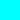

# Color spaces

Color spaces are reproducible representations of color. Most color spaces have three dimensions that describe properties of the color (such as color hue, saturation, luminance), or their composition of primary colors, using a certain [color model](https://en.wikipedia.org/wiki/Color_model).

## Summary

`colo` supports 11 color spaces, which are summarized in this table:

| Name                    | Description                     | Range of values     |
|-------------------------|---------------------------------|---------------------|
| [`rgb`](#srgb-rgb)      | red, green, blue                | 0 to 255            |
| [`cmy`](#cmy-cmy)       | cyan, magenta, yellow           | 0 to 1              |
| [`cmyk`](#cmyk-cmyk)    | cyan, magenta, yellow, key      | 0 to 1              |
| [`hsl`](#hsl-hsl)       | hue, saturation, light          | hue: 0 to 360, saturation: 0 to 1, light: 0 to 1     |
| [`hsv`](#hsv-hsv)       | hue, saturation, value          | hue: 0 to 360, saturation: 0 to 1, value: 0 to 1     |
| [`lab`](#cielab-lab)    | CIELAB (lightness, a, b)        | lightness: 0 to 100 |
| [`lch`](#cielch-lch)    | CIELCh (luminance, chroma, hue) | luminance: 0 to 100, chroma: 0 to 100, hue: 0 to 360 |
| [`luv`](#cieluv-luv)    | CIELUV (luminance, u, v)        | luminance: 0 to 100, u: -134 to 220, v: -140 to 122  |
| [`hunterlab`](#hunter-lab-hunterlab) | Hunter Lab (lightness, a, b) | lightness: 0 to 100 |
| [`xyz`](#cie-xyz-xyz)   | CIE XYZ (x, lightness, z)       | lightness: 0 to 100 |
| [`yxy`](#cie-yxy-yxy)   | CIE Yxy (lightness, x, y)       | lightness: 0 to 100 |

## sRGB (`rgb`)

[sRGB](https://en.wikipedia.org/wiki/SRGB) (often simply called _RGB_) is a color space of the three primary colors **red**, **green** and **blue**. It uses additive color mixing, which is how colored light works. The sRGB color space is therefore used by computer screens, for example.

Colors in the sRGB color space are represented as three values between 0 and 255. 0 means, the primary color is not present, whereas 255 means that the primary color is at full intensity.

### Examples

<pre class="color-examples">
rgb(  0,   0,   0)   
rgb(255,   0,   0)   
rgb(  0, 255,   0)   
rgb(  0,   0, 255)   
rgb(255, 255,   0)   
rgb(  0, 255, 255)   
rgb(255,   0, 255)   
rgb(255, 255, 255)   
</pre>

## CMY (`cmy`)

[CMY](https://en.wikipedia.org/wiki/CMY_color_model) is the counterpart of RGB: It consists of the primary colors **cyan**, **magenta** and **yellow**, and uses subtractive color mixing, so it behaves like color pigments or dyes.

CMY colors are represented as three values between 0 and 1, or 100%.

### Examples

<pre class="color-examples">
cmy(0, 0, 0)   
cmy(1, 0, 0)   
cmy(0, 1, 0)   
cmy(0, 0, 1)   
cmy(0, 1, 1)   
cmy(1, 0, 1)   
cmy(1, 1, 0)   
cmy(1, 1, 1)   
</pre>

## CMYK (`cmyk`)

CMYK is a variation of CMY that adds a fourth component, the **key**. This is used primarily by color printers: The CMY color components correspond to the color cartridges, whereas the _key_ corresponds to the black cartridge.

### Examples

<pre class="color-examples">
cmy(0, 0, 0, 0)   
cmy(1, 0, 0, 0)   
cmy(0, 1, 0, 0)   
cmy(0, 0, 1, 0)   
cmy(0, 1, 1, 0)   
cmy(1, 0, 1, 0)   
cmy(1, 1, 0, 0)   
cmy(0, 0, 0, 1)   
</pre>

## HSL (`hsl`)

[HSL](https://en.wikipedia.org/wiki/HSL_and_HSV) is a color space designed to be intuitive to understand. It consists of **hue**, **saturation** and **lightness**.

The hue is a value on a radial slice, represented in degrees (0 to 360), where 0 corresponds to red, 120 corresponds to green and 240 to blue. It is equivalent to the hue in the HSV color space.

Saturation and lightness are values between 0 and 1 (or 100%). When the lightness is 0, the color is full black. When it is 1, it is full white. The most vibrant colors are at a lightness of 0.5, or 50%.

### Examples

<pre class="color-examples">
hsl(  ?, ?,   0)   
hsl(  ?, ?,   1)   
hsl(  0, 1, 0.5)   
hsl( 60, 1, 0.5)   
hsl(120, 1, 0.5)   
hsl(180, 1, 0.5)   
hsl(240, 1, 0.5)   
hsl(300, 1, 0.5)   
</pre>

## HSV (`hsv`)

[HSV](https://en.wikipedia.org/wiki/HSL_and_HSV) is also a color space designed to be intuitive to understand. It consists of **hue**, **saturation** and **value**. The hue is the same as in the HSL model. Hue and saturation together describe the [chromaticity](https://en.wikipedia.org/wiki/Chromaticity).

Saturation and value are again values between 0 and 1. When the value is 0, the color is full black. When the value is 1, the color depends on the hue and saturation.

### Examples

<pre class="color-examples">
hsv(  ?, ?, 0)   
hsv(  ?, 0, 1)   
hsv(  0, 1, 1)   
hsv( 60, 1, 1)   
hsv(120, 1, 1)   
hsv(180, 1, 1)   
hsv(240, 1, 1)   
hsv(300, 1, 1)   
</pre>

## CIELAB (`lab`)

[CIELAB](https://en.wikipedia.org/wiki/CIELAB_color_space) is a color space consisting of three values: __L\*__ for the lightness from black (0) to white (100), __a\*__ from green (−) to red (+), and __b\*__ from blue (−) to yellow (+). It was designed so that the same amount of numerical change in these values corresponds to roughly the same amount of visually perceived change. __a\*__ and __b\*__ together describe the [chromaticity](https://en.wikipedia.org/wiki/Chromaticity) (hue and colorfulness).

CIELAB is designed to approximate human vision. Its __L\*__ component closely matches human perception of lightness.

## CIELCh (`lch`)

The following paragraphs are incomplete. Send a pull request to help!

[Wikipedia](https://en.wikipedia.org/wiki/CIELAB_color_space#Cylindrical_representation:_CIELCh_or_CIEHLC)

## CIELUV (`luv`)

[Wikipedia](https://en.wikipedia.org/wiki/CIELUV)

## Hunter Lab (`hunterlab`)

[Wikipedia](https://en.wikipedia.org/wiki/CIELAB_color_space#Hunter_Lab)

## CIE XYZ (`xyz`)

[Wikipedia](https://en.wikipedia.org/wiki/CIE_1931_color_space)

## CIE Yxy (`yxy`)

In CIE Yxy, Y is the luminance and x and y represents the chromaticity values derived from the tristimulus values X, Y and Z in the CIE XYZ color space.

The small x and y values are used to draw the chromacity diagram of the CIE XYZ color space. It is just another way to represent CIE XYZ.

[Source](https://wolfcrow.com/what-is-the-difference-between-cie-lab-cie-rgb-cie-xyy-and-cie-xyz/)
