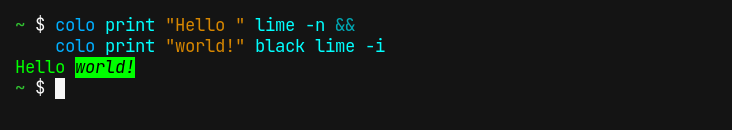
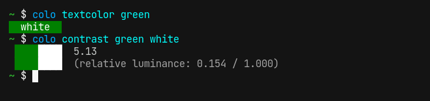
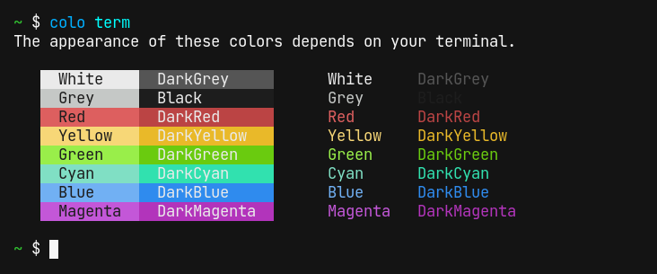

## Simple color management in the terminal

Run `colo s <COLOR>` to view a color. Colo supports HTML color names, hex colors and 11 different color spaces.

<pre class="toh-text">
&gt; colo s ff3377

 ████████  <b>#ff3377</b>                    rgb(255, 51, 119)        
 ████████  hsl(-20, 100%, 60%)        hsv(340, 80%, 100%)      
 ████████  cmy(0%, 80%, 53.3%)        cmyk(0%, 80%, 53.3%, 0%) 
 ████████  lch(57, 78.1, 9.2)         luv(57, 136.2, -0.1)     

&gt; colo s orange

 ████████  <b>#ffa500</b>  orange            rgb(255, 165, 0)         
 ████████  hsl(38.8, 100%, 50%)       hsv(38.8, 100%, 100%)    
 ████████  cmy(0%, 35.3%, 100%)       cmyk(0%, 35.3%, 100%, 0%)
 ████████  lch(74.9, 82.5, 73.1)      luv(74.9, 74.9, 74)      

&gt; colo s "hsv(300, 100%, 100%)"

 ████████  #ff00ff  fuchsia           rgb(255, 0, 255)         
 ████████  hsl(-60, 100%, 50%)        <b>hsv(300, 100%, 100%)     </b>
 ████████  cmy(0%, 100%, 0%)          cmyk(0%, 100%, 0%, 0%)   
 ████████  lch(60.3, 115.6, 328.2)    luv(60.3, 84.1, -108.7)  

&gt;  
</pre>

## 11 supported color spaces

Colo supports widely used color spaces, that should cover the needs for professional developers and designers. [More information](color_spaces.md).

## Powerful terminal features

Colo supports piping input from/to other commands or files.

<pre class="toh-text">
&gt; echo orange ff4400 | colo s -o hsl &gt; somefile.txt
&gt; cat somefile.txt
#ffa500
#ff4400
&gt; colo s &lt; somefile.txt

 ████████  <b>#ffa500</b>  orange            rgb(255, 165, 0)         
 ████████  hsl(38.8, 100%, 50%)       hsv(38.8, 100%, 100%)    
 ████████  cmy(0%, 35.3%, 100%)       cmyk(0%, 35.3%, 100%, 0%)
 ████████  lch(74.9, 82.5, 73.1)      luv(74.9, 74.9, 74)      

 ████████  <b>#ff4400</b>                    rgb(255, 68, 0)          
 ████████  hsl(16, 100%, 50%)         hsv(16, 100%, 100%)      
 ████████  cmy(0%, 73.3%, 100%)       cmyk(0%, 73.3%, 100%, 0%)
 ████████  lch(57.5, 96.9, 45.3)      luv(57.5, 151.7, 45.3)   

&gt;  
</pre>

## Flexible input

Hex colors can be entered in the formats `RGB`, `RRGGBB`, `RRRGGGBBB`, etc. Colors in different color spaces are entered in the format `color_space(value1, value2, value3)`, for example `hsl(30, 100%, 60%)`. The parentheses and commas are optional, so the following commands are equivalent:

<pre class="toh-text">
&gt; colo s "cmy(100%, 50%, 66.7%)"
&gt; colo s cmy 100% 50% 66.7%
&gt; colo s cmy 1 50% 66.7%
</pre>

## Print colored text

`colo print <TEXT> <COLORS>...` prints text with certain colors applied. There are also flags to make the text bold (`-b`), italic (`-i`) or underlined (`-u`), and a flag to continue printing in the same line (`-n`):

    

## Get color contrast

Check the contrast between two colors, and find out if white or black text is better readable on a background color.

    

## Show terminal colors

Display the default colors of your terminal.

    

## Experimental features

To get these features, build `colo` from the main branch:

<pre class="toh-text">
&gt; cargo install --git https://github.com/Aloso/colo
</pre>

### Random values

Random values can be used anywhere where colors can be used. For example:

<pre class="toh-text">
&gt; colo contrast rand rand
 ████████  2.30
 ████████  (relative luminance: 0.543 / 0.207)
&gt; colo s "hsl(rand, 100%, 50%)"

 ████████  #bf00ff                    rgb(191.3, 0, 255)       
 ████████  <b>hsl(285, 100%, 50%)      </b>  hsv(285, 100%, 100%)     
 ████████  cmy(25%, 100%, 0%)         cmyk(25%, 100%, 0%, 0%)  
 ████████  lch(49.9, 118.8, 318.8)    luv(49.9, 42.1, -126.2)  

&gt;  
</pre>
